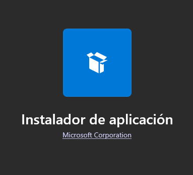
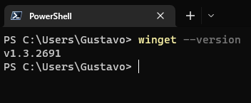
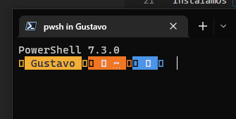
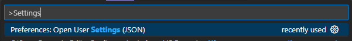
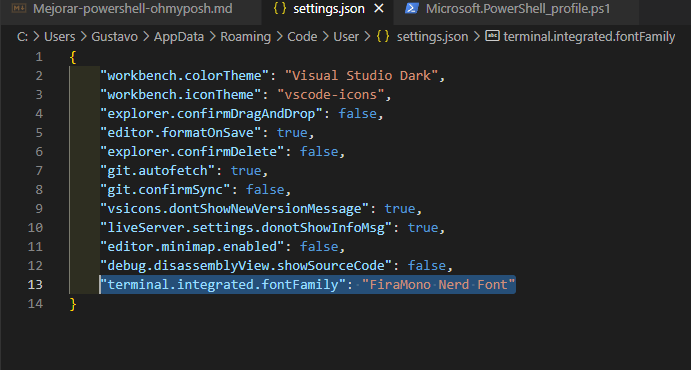

# Tutorial - Mejorando PowerShell!

<br>

En este tutorial vamos a aprender a darle un aspecto más vistoso a nuestra querida terminal. Para eso, vamos a instalar OhMyPosh en conjunto con un tipo de fuente conocida como Nerd Fonts.

<br>

## Primeros pasos

Necesitamos tener instalado el comando `winget` en nuestra compu. Esto se puede realizar sencillamente desde el Microsoft Store (buscando `App Installer`):



<br>

Luego, para verificar su correcto funcionamiento, vamos a la terminal y lo probamos:



<br>

Instalamos `Oh My Posh!` utilizando el siguiente comando:

```pwsh
    winget install JanDeDobbeleer.OhMyPosh
```
(Recordar luego cerrar y volver a abrir la terminal)

Si ya lo teníamos, o para en el futuro poder actualizarlo:

```pwsh
    winget upgrade oh-my-posh
```

## Pasamos a configurarlo

Verificamos qué shell está tomando por default:
```pwsh
    oh-my-posh get shell
```
(Debería decir pwsh)

Lo siguiente será editar nuestro profile del Powershell, al cual accedemos de la siguiente manera:
```pwsh
    code $profile
```
(Elegí code por comodidad, puede ser Notepad)

Adentro pegamos el siguiente comando:
```pwsh
    oh-my-posh init pwsh | Invoke-Expression
```

Finalmente recargamos el profile haciendo:
```pwsh
    . $profile
```

Vamos a pasar a tener un mamarracho:



Necesitamos configurar la tipografía para que se vean correctamente los íconos. Para esto, vamos a [Nerd Fonts](https://www.nerdfonts.com/) y elegimos la de nuestra preferencia (en mi caso, `Fira`).

Se descarga, se instala el font de la manera tradicional (arrastrándolo a la carpeta Fonts de Windows) y ya estamos.

Luego debemos ir a nuestra terminal, entrar a la configuración y decirle que use dicha tipografía (está en la solapa apariencia) para PowerShell. (Es auto explicativo a medida que vas clickeando en los menúes)

## Personalizamos!

Para esto, corremos el comando:
```pwsh
    Get-PoshThemes
```

Y así vamos a poder ver todos los temas que hay. Cuando eligamos uno que nos agrade, volvemos al archivo de configuración de PowerShell:
```pwsh
    code $profile
```

Y sobreescribimos lo anterior con el siguiente comando:
```pwsh
    oh-my-posh init pwsh --config "$env:POSH_THEMES_PATH\dracula.omp.json" | Invoke-Expression
```
En ese caso yo elegí el tema dracula, pero es simplemente cambiar el nombre por el que corresponda. La sintaxis del nombre la encontraremos en:

```pwsh
    C:\Users\<TU USUARIO>\AppData\Local\Programs\oh-my-posh\themes
```

Ya estamos!

## Cosas extra
Para poder ver íconos en la terminal para cada tipo de archivo, accedemos a [esta página](https://github.com/devblackops/Terminal-Icons) y hacemos 2 cosas:

1. Ingresamos este comando en PowerShell
   ```pwsh
       Install-Module -Name Terminal-Icons -Repository PSGallery
   ```
2. Y luego agregamos estas líneas en la configuración del PowerShell:
   ```pwsh
       Import-Module -Name Terminal-Icons
   ```

Recargamos la terminal y voilà!

Último: ahora para que se ajuste bien al Visual Studio Code: en el json de configuración, agregamos esta línea:
```pwsh
    "terminal.integrated.fontFamily": "FiraMono Nerd Font"
```
Para acceder al json, apretamos F1 y escribimos settings:



