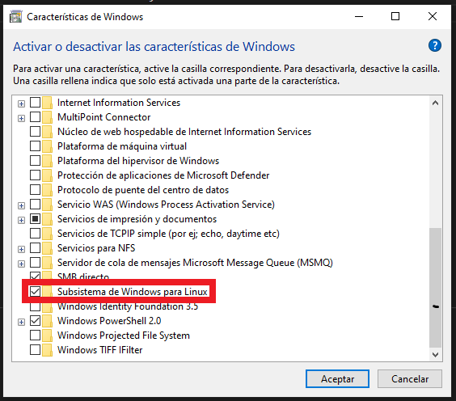
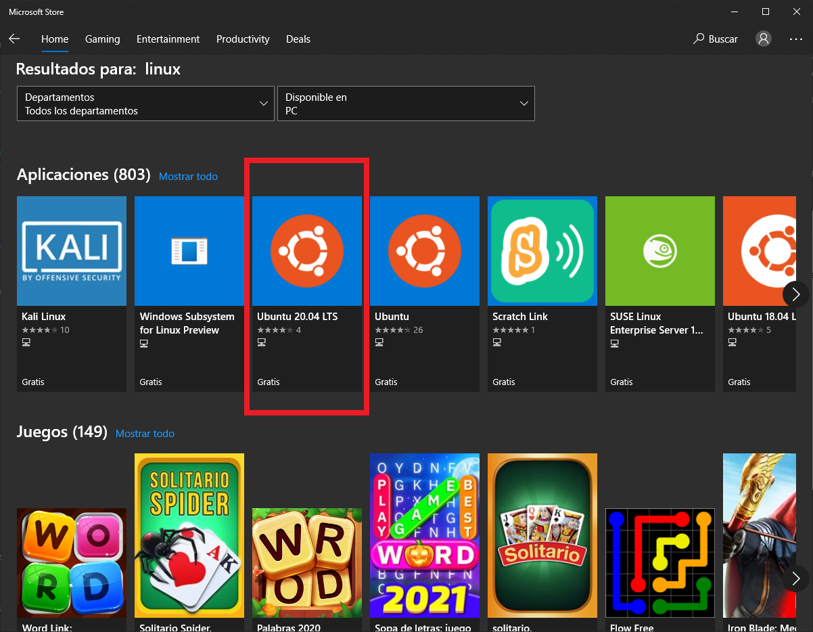
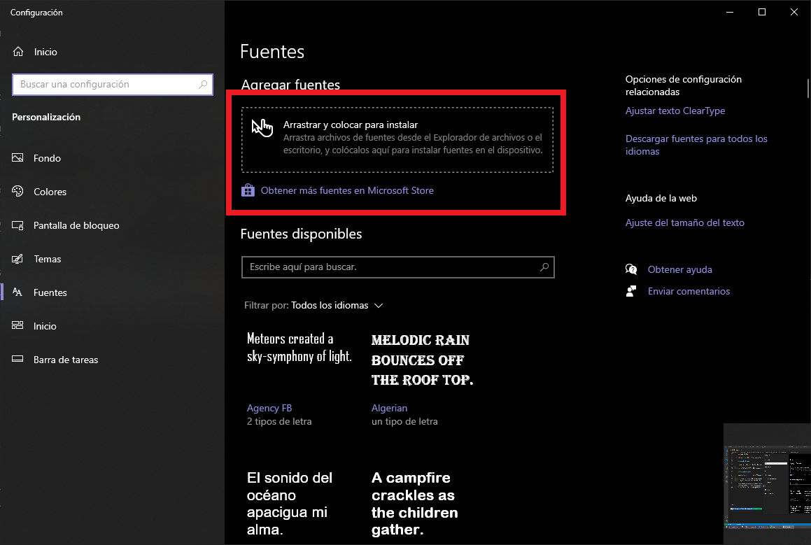

# Ohmyzsh para Windows 10 (Windows Subsystem for Linux)

`Z shell` (o simplemente `zsh`) es un potente intérprete de comandos para sistemas operativos de tipo Unix, como por ejemplo los BSD o GNU/Linux.
Como características principales podemos destacar:
1. Completar la línea de comandos programable que puede ayudar al usuario a escribir tanto las opciones como los argumentos de la mayoría de los comandos utilizados
2. Compartir el historial entre todos los shells en funcionamiento
3. Mejora del manejo de variables/arreglos
4. Corrección ortográfica y relleno automático de los nombres de los comandos (y opcionalmente de los argumentos, que se asumen como nombres de archivo)
5. Los avisos temáticos, incluyendo la capacidad de poner la información del aviso en el lado derecho de la pantalla y hacer que se oculte automáticamente cuando se teclea un comando largo

Por otro lado, `Ohmyzsh!` es un framework para manejar las configuraciones del `zsh`. Incorpora muchas funciones, temas, plugins que mejoran la interfaz del usuario y lo hacen más lindo!

Vamos a ver cómo instalar y configurarlo en Windows 10 haciendo uso del `WSL`, que no es más que un intérprete de Linux dentro de Windows tipo `CLI` (Command Line Interface).

## Instalando WSL

1. Necesitamos habilitar el **WSL** en nuestro Windows, para lo que vamos al *Inicio* y buscamos **"Activar o desactivar las características de Windows"**

    

2. Luego vamos al `Microsoft Store` y de ahí descargamos la distribución que querramos de Linux, por ejemplo `Ubuntu 20.04 LTS`

    

3. Una vez instalado desde el Store, accedemos al programa desde el inicio y se abrirá una interfaz de línea de comandos que nos pedirá una serie de pasos, en particular que creemos un **usuario** y una **contraseña**, y listo!

## Instalando Zsh

El paso más fácil:

- `sudo apt install zsh` y seguir los pasos!

- Luego hay que predeterminar el intérprete a zsh: `chsh -s $(which zsh)`
## Instalando Ohmyzsh

Este paso es realmente simple, hay que colocar la siguiente línea en la CLI:

    sh -c "$(curl -fsSL https://raw.github.com/ohmyzsh/ohmyzsh/master/tools/install.sh)"

## Configurando Ohmyzsh

1. Vamos a incorporar un tema llamado `Powerlevel10k` (su git está [acá](https://github.com/romkatv/powerlevel10k)). Para esto pegamos otro comando:

    git clone https://github.com/romkatv/powerlevel10k.git
    $ZSH_CUSTOM/themes/powerlevel10k

2. Luego vamos a tener que instalar unas fonts específicas para que todo se vea como corresponde. Para esto descargamos [este link](https://github.com/ryanoasis/nerd-fonts/blob/master/patched-fonts/FiraMono/Regular/complete/Fura%20Mono%20Regular%20Nerd%20Font%20Complete.otf?raw=true)
3. En inicio buscamos *Configuración de fuentes* y arrastramos a la casilla el archivo descargado para instalar dicha fuente.

    

4. Descargamos plugins para las auto-sugerencias y el resaltado de texto mediante las siguientes secuencias:

    git clone https://github.com/zsh-users/zsh-autosuggestions.git $ZSH_CUSTOM/plugins/zsh-autosuggestions

    git clone https://github.com/zsh-users/zsh-syntax-highlighting.git $ZSH_CUSTOM/plugins/zsh-syntax-highlighting

5. Ahora hay que editar el archivo de configuraciones de **ohmyzsh** llamado `.zshrc`
   1. podemos editarlo usando `nano`: `nano ~/.zshrc` directamente en la terminal
   2. Buscamos la línea correspondiente y la dejamos así: `ZSH_THEME="powerlevel10k/powerlevel10k"`
   3. Debajo ponemos `POWERLEVEL9K_MODE="nerdfont-complete"`
   4. Para habilitar las autocorrecciones quitamos el **#** de la línea `ENABLE_CORRECTION="true"`
   5. Una más: `plugins=(git zsh-autosuggestions zsh-syntax-highlighting)` (buscar la línea que dice **plugins=git()**)
   6. Grabamos, ¡y nos vamos!

6. Último paso (casi) es configurar la font que descargamos previamente. Para esto le damos botón derecho en la barra del título -> propiedades, solapa Fuente y elegimos una que nos muestre bien los simbolitos

***
***
Todo este pequeño tutorial fue sacado de internet, en particular de [este video](https://www.youtube.com/watch?v=su0h5StEZ6A&ab_channel=CreativeJE)(créditos para **CreativeJE**)
